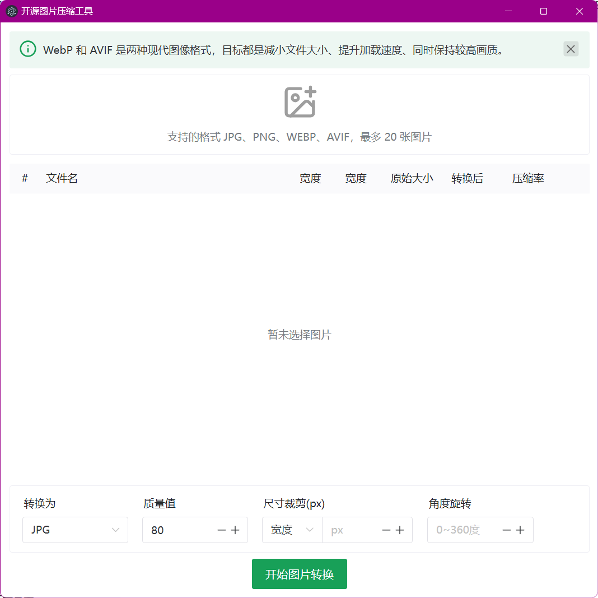

# 开源图片压缩工具
> 基于 Electon、Vue3 的图片压缩/转换工具

**系列博客**

* [需求思考及桌面应用开发技术选型](https://blog.csdn.net/ssrc0604hx/article/details/148117181)
* [Electron+Vue3+Rsbuild开发桌面应用](https://blog.csdn.net/ssrc0604hx/article/details/148164531)
* [图片生成PDF文档](https://blog.csdn.net/ssrc0604hx/article/details/148425044)
* [图片属性详解及读取解析元数据](https://blog.csdn.net/ssrc0604hx/article/details/148427409)
* [按指定高度垂直切割图片](https://blog.csdn.net/ssrc0604hx/article/details/148655838)
* [Electron应用配合 commander 提供命令行调用功能](https://blog.csdn.net/ssrc0604hx/article/details/148742140)

**📷程序截图**



## 二次开发

### 打包构建

```shell
# 打包前端（rsbuild）到 dist 目录
pnpm ui:build

# 构建客户端到 build 目录
pnpm package
```

如果碰到诸如`⨯ ENOENT: no such file or directory, stat`，提示 node_modules 下没有相应目录的错误，可以通过删除`node_modules`目录重新安装依赖解决😂
